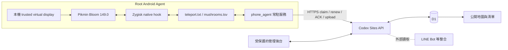

# Pikmin Mushroom Radar

Pikmin Bloom 蘑菇全球掃描、集中排程與即時地圖系統。

Root Android 手機上的 Zygisk 模組從遊戲地圖資料取得蘑菇資訊，手機端常駐 Agent 依雲端派發的座標自主掃描，再透過 HTTPS 將結果送進 Codex Sites／D1。公開網站負責地圖與清單呈現，受保護的管理後台負責多 Agent、工作佇列、國家城市包與每日區域輪替。

- 公開地圖：<https://mush.odyliao.cc/>
- 管理後台：<https://mush.odyliao.cc/admin>
- GitHub：<https://github.com/odyliao-lab/pikmin-mush>
- 正式工作目錄：`F:\Codex\Pikmin_Dev`

> [!IMPORTANT]
> Native hook 目前**鎖定 Pikmin Bloom 149.0／versionCode 1784082813**。遊戲升級後不可直接沿用既有 RVA；模組會檢查目標函式簽章並在不符合時 fail closed。

## 專案現況

截至 2026-07-23，正式架構已由「Windows 長時間接手機掃描」改為「手機自主 Agent + 雲端集中協調」：

- 三台實體 Android Agent 可並行掃描；一般運作不依賴 Windows、USB、ADB、固定手機 IP 或同一區域網路。
- 雲端以逐點 lease 分派座標，同一工作內的 Agent 不會掃到相同 target；Agent 離線、停用或 lease 逾時後，座標會重新排隊。
- 每日 `07:30 Asia/Taipei` 自動換區。現有 5 天輪替表涵蓋 68 個國家／區域包、435 個主要城市配置，三條當日路線互斥且城市數量差距不超過 2。
- 公開 API 與地圖已部署於 Codex Sites，資料存放於 D1；Windows 掃描器只保留作相容與維修用途。
- 正式資料只收錄等級 2–4 的蘑菇。等級 1 會在手機與雲端擷取管線中略過。

## 主要功能

### 公開地圖與清單

- 手機友善的皮克敏風格版面，Leaflet／OpenStreetMap 地圖與側邊清單同步顯示。
- 預設每 20 秒自動刷新，也可手動刷新。
- 等級多選：一般、大、巨大；預設顯示大與巨大。
- 類型多選；活動類型預設不勾選，未知類型保留為 `Type N`，避免資料被錯誤歸類。
- 可依國家、城市、POI 或 GPS 搜尋。
- 可依發現時間新→舊／舊→新、剩餘時間、等級排序；預設「發現時間新→舊」並將參加人數未滿 5 人的項目優先、異色標示。
- 地圖圖示依等級調整大小與顏色；目前參加人數 0–4 人時使用淺藍色提示。
- 蘑菇詳細資訊包含：
  - 等級、類型、國家－城市、POI、GPS
  - 目前參加人數／上限、參加者總戰力
  - 挑戰開始、挑戰結束、剩餘時間、資料更新時間
- 清單與 popup 都可複製 GPS 或精簡蘑菇資訊，並可直接開啟 Google 地圖。

### 雲端管理後台

- 建立國家城市包或自訂 GPS 範圍的單輪／持續循環掃描工作。
- 查看工作進度、目前國家／城市、點位數、擷取數、近期 log 與 Agent 線上狀態。
- 暫停、繼續或停止整體工作。
- 建立每台裝置獨立的 Agent ID／Token；Token 只在建立時顯示一次。
- 啟用、停用、暫停或恢復單一 Agent；停用時立即釋放其 lease。
- 設定 Agent 支援的國家範圍；每日自動輪替啟用時由中央排程接管區域。
- 顯示每日輪替日期、分配結果、對應 job 與下一次切換時間。
- 顯示 Fleet health、連續無資料警告、每點平均耗時、失敗／租約逾時與可下載的 24 小時 soak report。
- 顯示 Agent／遊戲／native module 版本；不相容版本保持在線但停止派工。
- 可安全換發 Agent Token；新 Token 只顯示一次，舊 Token 最多保留 24 小時供遠端裝置切換，也可提前撤銷。
- 發報前可將候選座標優先派給指定 Agent 複查；完成後自動返回原工作座標，只有最新參加人數仍低於 5 的蘑菇才可發布。

### 國家城市包與每日輪替

國家目錄集中在 `site/lib/scan-plans.ts`，目前包含：

- 亞洲：日本、印度、韓國、台灣、泰國、馬來西亞、新加坡、印尼、菲律賓、越南
- 大洋洲：澳洲、紐西蘭
- 南美洲：巴西、厄瓜多、阿根廷、哥倫比亞、秘魯、智利、烏拉圭、巴拉圭、玻利維亞、委內瑞拉
- 北歐：瑞典、挪威、丹麥、芬蘭、冰島
- 中東：阿拉伯聯合大公國、沙烏地阿拉伯、以色列、約旦、卡達
- 中歐：德國、奧地利、瑞士、捷克、波蘭、匈牙利
- 南歐：義大利、西班牙、葡萄牙、希臘、克羅埃西亞
- 北非：埃及、摩洛哥、阿爾及利亞、突尼西亞
- 西歐：英國、法國、荷蘭、比利時、愛爾蘭
- 東歐：羅馬尼亞、保加利亞、塞爾維亞、斯洛伐克、斯洛維尼亞
- 中美洲：墨西哥、貝里斯、瓜地馬拉、宏都拉斯、薩爾瓦多、尼加拉瓜、哥斯大黎加、巴拿馬
- 北美洲：美國東部、美國中部、美國西部

輪替規則位於 `site/lib/rotation-plan.mjs`：

- 以台北時間每日 07:30 為換日界線，不需要 PC cron 常駐。
- 第一個 Agent 或後台請求會以 D1 狀態鎖補做當日唯一一次輪替。
- 只納入最近 5 分鐘有回報、已啟用且未暫停的 Agent。
- 同一天三條路線的國家包互不重疊；下一個 5 天週期反轉分配順序。
- Agent 清單改變時會重新平衡，停止舊工作並建立新的循環工作。
- 每次重排都會讓舊 lease／ACK fail closed，避免舊區域結果污染新工作。

## 系統架構



### Android 端

1. `module/` 的 Zygisk 模組注入遊戲程序，讀取蘑菇欄位並呼叫遊戲內建的 debug location override。
2. 座標命令寫入遊戲私有目錄的 `teleport.txt`；掃描結果累積寫入 `mushrooms.tsv`。
3. `phone_agent/agent.sh` 向雲端 claim target、續租、增量讀取 TSV、上傳、ACK，並處理 pause／stop。
4. `service.sh` 在開機完成後啟動 Agent；`action.sh` 提供 Magisk 中的手動冷重啟與程序驗證。
5. 可選的 `local-display.sh` 在手機內建立 trusted virtual display，使實體螢幕關閉時遊戲仍維持可掃描狀態，並自動處理已驗證的啟動畫面。

### 雲端端

1. `site/` 是 Vinext／React 應用與 Cloudflare Worker，部署到 Codex Sites。
2. D1 保存蘑菇、Agent、工作、target lease、log 與每日輪替狀態。
3. Agent v2 API 負責逐點派工、續租與 ACK；上傳 API 解析 UTF-8 TSV 並以蘑菇 ID upsert。事件表保存心跳、完成、無資料、失敗、租約逾時與耗時，供 24 小時報表使用。
4. 公開 `/api/mushrooms` 只輸出蘑菇、彙總 fleet 狀態與粗粒度進度；精確 Agent 資訊只在受保護的後台提供。

### Windows 端

Windows 現在只用於開發、原生模組建置、首次安裝、升級與故障維修。`scanner/scanner.py`、`scanner/scanner_gui.py` 和舊地圖仍保留，但不是正式多 Agent 架構的必要常駐元件。

## 目錄結構

| 路徑 | 用途 |
| --- | --- |
| `module/cpp/` | Pikmin 149.0 的 Zygisk hook、自動定位與 TSV 寫入原始碼 |
| `module/build-dual-abi.ps1` | 使用 Android NDK 建置 ARM64 與 x86_64 |
| `module/package-module.ps1` | 產生 Magisk ZIP 並驗證 ZIP 路徑格式 |
| `module/arm64-v8a.so` | 目前 ARM64 native 產物 |
| `module/pikmin_hunter.zip` | Zygisk Magisk 安裝包 |
| `phone_agent/` | Android 常駐 Agent、開機服務、虛擬顯示與復原工具 |
| `site/` | 公開地圖、管理後台、API、D1 schema、migration 與測試 |
| `scanner/` | 舊 Windows 掃描器與維修工具；runtime DB、log、token 不納入 Git |
| `reference/` | 本機 IL2CPP 逆向資料；大型 dump 不納入 Git |
| `radar/` | 更早期半自動工具，僅供歷史參考 |
| `SPEC_*.md` | Native、手機顯示、supervisor、全球 fleet 的詳細規格 |

## 開發環境

### 網站

- Node.js `>= 22.13.0`
- npm（依 `site/package-lock.json` 使用 `npm ci`）
- Codex Sites 專案與 D1 binding（正式部署時）

```powershell
Set-Location F:\Codex\Pikmin_Dev\site
Copy-Item .env.example .env.local
# 只在本機填入必要值；不要提交 .env.local
npm ci
npm run dev
```

環境變數：

| 名稱 | 用途 |
| --- | --- |
| `AGENT_TOKEN` | legacy primary Agent 相容憑證；新 Agent 使用各自雜湊憑證 |
| `CONTROLLER_TOKEN` | legacy Windows controller 的獨立維修憑證，至少 32 bytes |
| `ADMIN_EMAILS` | 可進入管理後台的 ChatGPT 帳號 email allowlist |

### Native 模組

- Windows PowerShell
- Android NDK r27d
- CMake、Ninja
- Google 官方 Android Platform-Tools
- Root Android、Magisk、Zygisk
- Pikmin Bloom 149.0／versionCode 1784082813

Google Drive 的中文路徑曾造成 Android CMake 工具鏈路徑損壞；建置請使用正式的 ASCII 工作目錄 `F:\Codex\Pikmin_Dev`，必要時再 staging 到 `C:\Users\Ody\Downloads\pikmin_build`。

```powershell
Set-Location F:\Codex\Pikmin_Dev
powershell.exe -NoProfile -ExecutionPolicy Bypass -File .\module\build-dual-abi.ps1
powershell.exe -NoProfile -ExecutionPolicy Bypass -File .\module\package-module.ps1
```

不要用 Windows `Compress-Archive` 直接製作 Magisk ZIP；反斜線 entry 可能讓 Magisk 無法識別 `zygisk/arm64-v8a.so`。請一律使用專案內的 packaging script。

## 安裝與新增 Agent

> [!CAUTION]
> 目前實作需要 root + Magisk + Zygisk，並會存取遊戲私有檔案、注入遊戲程序及覆寫遊戲內定位。請自行評估遊戲服務條款、帳號與裝置風險。

高階流程如下；完整命令與驗證矩陣請讀 `SPEC_ON_DEVICE_DISPLAY.md` 與 `phone_agent/README.md`。

1. 確認遊戲版本與 ABI；149.0 以外的版本不可直接安裝既有 native hook。
2. 安裝 `module/pikmin_hunter.zip` 並重開機。Zygisk 只在 zygote 載入，更新 `.so` 後也必須 reboot。
3. 從管理後台建立新的 Agent，保存只顯示一次的 ID／Token。
4. 將 `phone_agent/` 安裝到 `/data/adb/modules/pikmin_scanner_agent/`，正式 token 放在手機端 `token`，設定放在 `config`；每台裝置的 `AGENT_ID` 必須唯一。
5. 視裝置啟用 `LOCAL_DISPLAY=1`，完成 virtual display 與啟動畫面座標校正。
6. 重開機後確認 `agent.log` 持續 claim target，並確認雲端 uploaded count 實際增加。

一般掃描不需要 ADB。首次安裝或故障維修建議使用 Google 官方 ADB：

```text
%LOCALAPPDATA%\CodexTools\android-platform-tools\platform-tools\adb.exe
```

## Agent v2 工作流程

1. Agent 以 `Authorization: Bearer …` 與 `X-Agent-Id` 呼叫 `/api/agent/v2/task`。
2. 雲端只從該 Agent 允許的 country tags 中選 target，建立有期限的 lease。
3. Agent 寫入座標、等待 native map refresh marker、增量上傳 TSV，並週期性呼叫 control 續租。
4. 完成後以 lease token ACK；pause、stop、失聯或過期 lease 都不會被當成成功。
5. 循環工作完成一輪後會建立下一個 cycle；非循環工作在 target 全數完成後結束。

正式判斷掃描成功時，不只看後台設定或 GPS log。至少要同時看到：

- 手機 `/data/adb/modules/pikmin_scanner_agent/agent.log` 收到正確國家／城市的 target。
- `mushrooms.tsv` 有新資料，或 Agent 正常回報該點沒有新增資料。
- 雲端工作完成數與 uploaded count 持續成長。

## 資料模型與 API

主要 D1 tables：

| Table | 內容 |
| --- | --- |
| `mushrooms` | 座標、等級、類型、起訖時間、參加人數、戰力與 first/last seen |
| `scan_agents` | 每台 Agent 的憑證雜湊、能力、區域、狀態與累積上傳量 |
| `scan_jobs` | 掃描設定、進度、cycle、目前城市與擷取統計 |
| `scan_targets` | 每個座標的狀態、Agent lease、重試與完成資訊 |
| `scan_logs` | 工作事件與錯誤 |
| `scan_agent_events` | Fleet 心跳、掃描結果、無資料、失敗、租約逾時與耗時 |
| `scan_rotation_settings` | 每日輪替設定 |
| `scan_rotation_runs` | 每日實際分配、job 與狀態 |

主要路由：

| 路由 | 權限 | 用途 |
| --- | --- | --- |
| `GET /api/mushrooms` | 公開 | 未過期蘑菇、彙總 fleet 與粗粒度進度；支援 `bbox=west,south,east,north`、`limit` 與 cursor |
| `GET /api/admin/metrics?hours=24` | 管理者 | Fleet health 與指定觀測窗的 soak report |
| `/api/admin/scans/**` | 管理者 | 建立、查看、暫停、繼續、停止工作 |
| `/api/admin/agents/**` | 管理者 | 建立、設定、暫停、啟用與停用 Agent |
| `/api/agent/v2/task` | 每台 Agent | claim target |
| `/api/agent/v2/control` | 每台 Agent | 續租及取得 pause／stop |
| `/api/agent/v2/ack` | 每台 Agent | 回報 target 結果 |
| `/api/agent/upload` | 每台 Agent | 增量上傳 UTF-8 TSV |
| `/api/controller/**` | controller token | legacy Windows 維修控制 |

上傳端設有 body、partial row 與單批筆數上限；經緯度、類型、時間與參加資訊都會正規化。蘑菇以 ID upsert，累積 TSV 不可用「本次檔案總筆數」直接當成新增量。

沒有查詢參數的 `/api/mushrooms` 仍保留舊版全量回應，供既有 LINE Bot 等整合相容使用；公開地圖改用 viewport bbox 與每頁最多 1,000 筆的 cursor pagination，單次畫面最多載入 3,000 筆並提示使用者放大地圖。

## 測試與品質門檻

網站修改提交前：

```powershell
Set-Location F:\Codex\Pikmin_Dev\site
npm ci
npm run lint
npm test
```

`npm test` 會先執行 production build，再驗證 rendered HTML／安全標頭與每日輪替計畫。GitHub `Security CI` 另外執行：

- lint
- production build 與 Node tests
- `npm audit --audit-level=moderate`
- `bash -n phone_agent/agent.sh`

`main` 需透過 Pull Request，且 `validate` check 通過後才可合併；目前不要求另一位 reviewer，repo owner 可自行 merge。

Native 或 Agent 變更除靜態檢查外，仍必須完成實機端到端驗證：版本簽章、hook log、target 城市、TSV、upload count 與 ACK 缺一不可。

## 部署

### Codex Sites／D1

`site/.openai/hosting.json` 保存 Sites project 與 D1 binding。部署原則：

1. 在功能分支完成 migration、lint、test 與 PR。
2. 合併到 `main`，使用完整 HEAD SHA 建立 Sites version。
3. 部署產物必須包含 `site/drizzle/` migrations。
4. 等待部署狀態到 `succeeded`。
5. 驗證 `/`、`/map`、`/api/mushrooms`、登入後的 `/admin` 與實機 Agent 上傳。

只有 README 或不影響 `site/` 的文件變更不需要重新部署網站。詳細 Sites 流程與維運檢查見 `CLAUDE_HANDOFF.md` 與 `DEPLOY_per_agent_pause.md`。

### Android

- Native `.so` 更新後必須重開機。
- 更新 `phone_agent/` 時保留裝置既有的 `config` 與 `token`，shell 檔權限設為 `0700`，再重啟 `service.sh`。
- Magisk 的「Pikmin Scanner Agent」action 可執行受限時長的冷重啟；它只終止本模組擁有且 cmdline 符合的程序。

## 安全設計

- `/admin` 依 `ADMIN_EMAILS` 與 Codex Sites 提供的 authenticated user header 授權。
- 管理後台所有寫入路由檢查 same-origin。
- 每台 Agent 使用獨立 token，伺服器只保存雜湊；legacy primary token 與 controller token 不共用。
- Token rotation 保存新 hash 與有期限的舊 hash；舊 Token 最多 24 小時後失效，可由後台立即撤銷。
- 公開 API 不暴露 Agent ID、精確 Agent 位置、target ID、裝置版本或內部計數器。
- 上傳採 bounded UTF-8 parsing，拒絕過大 body、過長 partial row 與過多 rows。
- 正式站點回傳 HSTS、CSP、`nosniff`、frame denial、referrer policy 與 permissions policy。
- `.env*`、token、runtime DB／log、逆向 dump、部署包與本機 Agent metadata 都由 `.gitignore` 排除。
- Repo 為 public；任何正式憑證都不得放進 commit、PR、Issue、log 截圖或 `github_info.txt`。

若 Agent token 疑似外洩，應立即停用該 Agent、釋放 lease、建立新憑證並只更新該裝置。完整處置流程見 `SECURITY.md`。

## 外部整合

LINE Bot 是獨立 repo／獨立服務，透過公開蘑菇 API 產生條件式即時批次通知與早晚報；它不是本 repo 的 Sites 或 Android 部署內容。修改通知規則時應在 LINE Bot 專案完成，避免把 Bot 憑證或排程責任混入掃描核心。

## 已知限制

- Native hook 與 Pikmin 版本強綁；遊戲更新後需要重新 dump、產生 RVA／簽章並重新實機驗證。
- 目前手機端方案需要 root、Magisk、Zygisk；一般 Android 模擬器或未 root 手機不能直接成為同等 Agent。
- 遊戲使用 secure surface，常規 screenshot automation 可能只得到黑畫面；驗證以 hook／Agent log、TSV 與雲端計數為主。
- 大幅跨區移動可能觸發遊戲提示或伺服器冷卻；掃描計畫需保留合理 dwell／cooldown。
- 每日輪替採 request-driven lazy trigger；07:30 後需有 Agent 或管理後台請求才會執行，並非獨立常駐 cron。
- `SPEC_autoscan.md` 保留底層歷史與原始 §6／§7 流程，其中 Windows 主控與「尚未驗證」等敘述可能早於現行 cloud fleet；正式現況以本 README、程式碼與最近實機驗證為準。

## 文件索引

建議依任務選讀，不必從頭讀完所有歷史文件：

1. `README.md`：正式現況、架構與日常入口（本文件）。
2. `SECURITY.md`：信任邊界、secret、部署安全檢查與事件處置。
3. `SPEC_autoscan.md`：Pikmin 149.0 hook、欄位偏移、native build／deploy 與 gotchas。
4. `phone_agent/README.md`：Agent 協定、設定與手機端更新。
5. `SPEC_ON_DEVICE_DISPLAY.md`：手機自主 virtual display、開機、安裝與多機驗證。
6. `SPEC_HEADLESS_SUPERVISOR.md`：Windows 維修 supervisor 與 recovery state machine。
7. `SPEC_GLOBAL_FLEET.md`：全球 fleet 長期設計、容量、v3 scheduler roadmap 與已實作的每日輪替。
8. `CLAUDE_HANDOFF.md`：較完整的歷史移交與維運細節；部分狀態快照可能已過期。
9. `DEV_HISTORY.md`、`WORKLOG.md`、`DESIGN_autoscan.md`、`HOOK_TARGETS.md`：追查歷史決策、RVA 與舊問題時使用。

## 後續開發方向

- 將國家／城市 catalog 從 TypeScript 拆成可版本化與驗證的資料集。
- 導入 campaign／region／freshness 模型與 scheduler v3，依資料新鮮度、Agent 能力、失敗率與距離動態派工。
- 增加 fleet 觀測頁、城市 freshness heatmap、長時間 soak test 與 Agent 遠端版本管理。
- 研究不依賴 encoder 的手機顯示 backend，降低 virtual display 的耗電與相容性成本。
- 增加更多歐美、非洲與亞洲國家，同時維持 region hard constraint、互斥派工與可回滾 migration。

本專案是非官方研究與個人維運工具，與 Niantic 或 Nintendo 無關。
