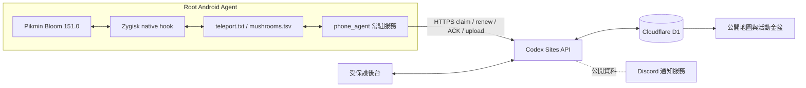

# Pikmin Mushroom Radar

Pikmin Bloom 蘑菇全球掃描、集中排程與公開地圖系統。Root Android 裝置上的 Zygisk 模組擷取遊戲地圖資料；常駐手機 Agent 依雲端派發的座標掃描，透過 HTTPS 上傳至 Codex Sites／Cloudflare D1。公開網站提供地圖、清單與活動金盆，受保護後台管理工作、裝置與輪替。

- 公開地圖：<https://mush.odyliao.cc/>
- 活動金盆：<https://mush.odyliao.cc/event-spots.html>
- 管理後台：<https://mush.odyliao.cc/admin>
- GitHub：<https://github.com/odyliao-lab/pikmin-mush>
- 建置目錄：`F:\Codex\Pikmin_Dev`（避免 Google Drive 中文路徑影響 Android CMake）

> [!IMPORTANT]
> Native hook 最新原始碼鎖定 **Pikmin Bloom 152.0／versionCode 1787540739**。遊戲更新後不可沿用舊 RVA；模組驗證對應函式簽章，不符合即停止 hook（fail closed）。152 已在 Leo ARM64 驗證擷取與換點；其他仍使用 151 的手機必須保留相符的 151 模組，不能直接覆蓋。部署驗證進度見 `docs/LEO_152_VALIDATION_2026-09-07.md`。

## 目前狀態

截至 2026-08-25，正式架構為「三台手機自主 Agent + 雲端集中協調」。正式機隊為 **Agent Aries、Agent Cancer、Agent Leo**；日常掃描不依賴 Windows、USB、ADB、固定 IP 或同一 Wi-Fi，ADB 僅供安裝、升級與維修。

- 雲端以逐點 lease 分派 target；停用、暫停、離線或 lease 逾時會安全釋放並重排。
- 正式資料僅保留等級 2–4；等級 1 在手機與雲端擷取流程中略過。
- 全域掃描預設為 **1 km 偏移網格**，每個 cycle 依四個相位改變網格原點，降低重複涵蓋。後台另提供固定 **500 m 精細模式**。
- 每日 `04:00`、`12:00`、`20:00`（Asia/Taipei）重建輪替工作，每段 8 小時。它是 request-driven：時間到後由 Agent 或後台的下一個請求觸發，並由 D1 狀態鎖保證每時段只執行一次。
- Codex Sites 提供網站與 Worker，D1 保存掃描與排程資料。Windows `scanner/` 僅保留作相容與維修用途。

## 使用功能

### 公開地圖與清單

- 手機友善的 Leaflet／OpenStreetMap 地圖與清單；地圖預設每 20 秒刷新，清單第一頁每分鐘更新。載入多頁時保留瀏覽位置與快照時間，可隨時按「立即刷新」回到最新第一頁。
- 等級、類型多選、國家／城市／POI／GPS 搜尋與多種排序；活動類型預設不顯示。
- 預設以最新發現排序，優先且異色標示參加人數未滿 5 人的蘑菇；圖示會依等級和低人數狀態變化。
- 詳情含等級、類型、國家－城市、POI、GPS、參加人數／上限、總戰力、挑戰起訖、剩餘時間、更新時間與發現 Agent 名稱。
- 可複製 GPS 或精簡資訊、開啟 Google 地圖。前端採 viewport bbox + cursor pagination，避免資料量增加後拖慢地圖。

### 活動金盆

`/event-spots.html` 與蘑菇掃描分離，提供可追溯的常設／限時活動資源點：

- 顯示活動期間、獎勵、資格、限制、座標說明及來源 URL。
- 可依國家、有效狀態或關鍵字篩選，複製 GPS 或在地圖定位。
- 官方與社群座標明確區分，並保留驗證日期與座標精度註記，避免把概略位置當成官方精確點位。

### 雲端管理後台

- 建立國家城市包或自訂 GPS 範圍的單輪／循環工作。
- 查看工作、目前城市、點位、擷取數、log、fleet health、連續無資料告警、每點耗時與 24 小時 soak report。
- 暫停、恢復、停用或啟用 Agent；停用時立即釋放 lease。
- 建立獨立 Agent 憑證、查看 Agent／遊戲／module 版本、換發及撤銷 token。
- 發報前可優先派工複查候選點，完成後自動回到原工作。

### 國家城市包與每日輪替

完整 catalog 位於 `site/lib/scan-plans.ts`，自動輪替規則位於 `site/lib/rotation-plan.mjs`。

- 04:00 掃亞洲／大洋洲，12:00 掃歐洲／中東／北非，20:00 掃北美／中美／南美；每個城市包在規定時段必須已進入當地當日 01:00 以後。
- **台灣與日本不納入自動輪替。** 既有 catalog 僅供歷史／必要時的手動管理，並非每日排程來源。
- 四條同時段路線互不重疊；每日更換 Agent 與路線對應。若少於四台可派工，會把同時段全部城市包重新均分，不丟掉第四條路線。定時任務按時段容量對每城取樣並於循環時偏移，不把完整 8km 網格一次排進短時段。
- Agent 名單改變、手動重排或排程換區時，系統會停止舊工作、使舊 lease 失效並新建循環工作，避免舊區域回傳污染新工作。

## 架構


```mermaid
flowchart LR
  subgraph Android[Root Android Agent]
    Game[Pikmin Bloom 151.0] <--> Hook[Zygisk native hook]
    Hook <--> Files[teleport.txt / mushrooms.tsv]
    Files <--> Agent[phone_agent 常駐服務]
  end
  Agent -->|HTTPS claim / renew / ACK / upload| API[Codex Sites API]
  API <--> D1[(Cloudflare D1)]
  D1 --> Public[公開地圖與活動金盆]
  Admin[受保護後台] <--> API
  API -.公開資料.- Discord[Discord 通知服務]
```

### Android

1. `module/` Zygisk 模組注入遊戲，讀取蘑菇欄位並使用遊戲內定位覆寫流程。
2. target 寫至 `teleport.txt`，擷取結果累積寫入 `mushrooms.tsv`。
3. `phone_agent/agent.sh` claim、續租、等待 map refresh、增量上傳 TSV、ACK，並處理 pause／stop／復原。
4. `service.sh` 開機後啟動 Agent；Magisk action 可做受限時長冷重啟與程序檢查。
5. 正式機隊使用實體螢幕正常顯示遊戲（`LOCAL_DISPLAY=0`）。virtual display 僅為相容／診斷選項，需另行驗證。

### 雲端與 Windows

- `site/` 包含 Vinext／React、Cloudflare Worker、D1 migration 與測試；Agent v2 API 支援逐點派工、續租、ACK、TSV upload 與 fleet metrics。
- 公開 `/api/mushrooms` 會輸出未過期資料、粗粒度進度及發現 Agent 的顯示名稱；不輸出 token、裝置定位、target／lease、裝置版本或內部計數器。
- Windows 用於開發、native build、首次安裝、升級及維修；舊掃描器不是正式 fleet 必要元件。

## 專案結構

| 路徑 | 用途 |
| --- | --- |
| `module/cpp/` | Pikmin 151.0 Zygisk hook、定位與 TSV 寫入原始碼 |
| `module/build-dual-abi.ps1` | Android NDK ARM64／x86_64 建置 |
| `module/package-module.ps1` | Magisk ZIP 建立與路徑驗證 |
| `phone_agent/` | Android Agent、開機服務、復原與 virtual display 工具 |
| `agent_control_app/` | 手機端 GPS／城市／掃描結果與暫停控制 App |
| `site/` | 網站、活動金盆、後台、API、D1 schema／migration／測試 |
| `scanner/` | 舊 Windows 掃描器與維修工具 |
| `reference/` | 本機 IL2CPP 逆向參考資料；大型 dump 不納入 Git |
| `SPEC_*.md` | Native、顯示、supervisor、fleet 的詳細規格與歷史 |

## 開發、測試與部署

### 網站

需求：Node.js `>= 22.13.0`、npm，及正式部署用 Codex Sites／D1 權限。

```powershell
Set-Location F:\Codex\Pikmin_Dev\site
Copy-Item .env.example .env.local
npm ci
npm run dev
npm run lint
npm test
```

`.env.local` 只在本機保存必要資料，絕不可提交。`ADMIN_EMAILS` 管理後台 allowlist；`AGENT_TOKEN`、`CONTROLLER_TOKEN` 僅為 legacy 相容／維修，新 Agent 均用個別 token 雜湊保存。

### Native 模組

需求：Windows PowerShell、Android NDK r27d、CMake、Ninja、Google Platform-Tools、已 root 並啟用 Magisk／Zygisk 的 Android，以及精確的 151.0 遊戲 build。

```powershell
Set-Location F:\Codex\Pikmin_Dev
powershell.exe -NoProfile -ExecutionPolicy Bypass -File .\module\build-dual-abi.ps1
powershell.exe -NoProfile -ExecutionPolicy Bypass -File .\module\package-module.ps1
```

請勿用 Windows `Compress-Archive` 自製 Magisk ZIP；一律使用專案 packaging script，確保 ZIP 內 `zygisk/` 路徑正確。

### Agent 安裝／升級

> [!CAUTION]
> 方案需要 root、Magisk、Zygisk，並會讀取遊戲私有檔案、注入遊戲程序和覆寫定位。請自行評估遊戲服務條款、帳號與裝置風險。

1. 確認 ABI、Magisk／Zygisk 和 **151.0／1786062771**。
2. 安裝 `module/pikmin_hunter.zip` 後重開機；native `.so` 更新也必須 reboot。
3. 在後台建立 Agent，將一次性顯示的 ID／token 只寫入該手機私有 `config`／`token`。
4. 部署 `phone_agent/` 到 `/data/adb/modules/pikmin_scanner_agent/`，保留既有 config／token，shell 檔權限為 `0700`。
5. 保持 `LOCAL_DISPLAY=0`，除非裝置已完成 virtual display 驗證；Android 9 GPS bridge 依 `phone_agent/config.example` 設定。
6. 重啟後，同時確認 target 城市、map refresh、TSV 新行、uploaded count 與 ACK。

日常掃描不需要 ADB。首次安裝或維修可使用 Google 官方 ADB，例如 `%LOCALAPPDATA%\CodexTools\android-platform-tools\platform-tools\adb.exe`。

### Sites／D1

程式碼流程是 feature branch → PR → checks → merge。合併後若 `site/` 有變更，依 `CLAUDE_HANDOFF.md` 產生 `site` subtree、以短效 source credential 建版、部署至 `succeeded`，並驗證 `/`、`/map.html`、`/event-spots.html`、`/api/mushrooms`、`/api/event-spots` 和登入後的 `/admin`。純 README／非 `site/` 文件變更不需重部署。

Native 或 Agent 變更必須完成實機端到端驗證：版本簽章、hook log、目標城市、TSV、upload、ACK 缺一不可。

## Agent 流程與 API

1. Agent 以 Bearer token 與 `X-Agent-Id` 呼叫 `/api/agent/v2/task`。
2. 雲端依 Agent 可用區域與現行 job 核發有期限 lease。
3. Agent 寫入 target、等待 native refresh marker、上傳新 TSV row，並經 control 續租。
4. 成功後以 lease token ACK；pause、stop、失聯和過期 lease 不會被視為成功。
5. 循環工作完成後以新 cycle 重建偏移網格；非循環工作則結束。

| 路由 | 權限 | 用途 |
| --- | --- | --- |
| `GET /api/mushrooms` | 公開 | 未過期蘑菇；支援 `bbox`、`limit`、cursor |
| `GET /api/event-spots` | 公開 | 活動金盆資料與有效狀態篩選 |
| `GET /api/admin/metrics?hours=24` | 管理者 | fleet health 與 soak report |
| `/api/admin/scans/**` | 管理者 | 建立、查看、暫停、恢復、停止工作 |
| `/api/admin/agents/**` | 管理者 | Agent 設定、狀態與 token rotation |
| `/api/agent/v2/task`、`/control`、`/ack` | Agent | claim、續租／控制、回報結果 |
| `/api/agent/upload` | Agent | 增量 UTF-8 TSV upload |

`mushrooms.tsv` 是累積檔；新增量必須以新 row／蘑菇 ID 判斷，不能以檔案總行數推論。上傳端對 body、row 數與欄位做邊界檢查及正規化。

公開蘑菇 API 所有請求均分頁（預設 500、每頁最多 1,000 筆）；完整結果須沿 `next_cursor` 讀到結束，並非總數上限。網頁可使用 15 秒短快取，Discord 原有查詢維持不快取。分頁相容性、限流與觀測方式見 [公開查詢效能說明](docs/PUBLIC_MAP_EFFICIENCY.md)。

## 安全與維運

- `/admin` 依 `ADMIN_EMAILS` 與 Sites authenticated-user header 授權；所有後台寫入檢查 same-origin。
- 每台 Agent 使用獨立 token，伺服器只保存雜湊；rotation 有受限過渡期，可立即撤銷。
- 公開 API 不回傳 token、精確裝置位置、target／lease、版本或內部計數器。發現 Agent 名稱只代表資料出處，不代表即時位置。
- 站點啟用 HSTS、CSP、`nosniff`、frame denial、referrer 與 permissions policy；上傳採 bounded UTF-8 parsing。
- `.env*`、token、DB／log、dump、部署包與裝置 metadata 均須 Git ignore。public repo、PR、Issue、截圖與交接文件不得出現任何憑證。
- token 疑似外洩時，立即停用 Agent、釋放 lease、換發憑證並只更新該裝置；詳見 `SECURITY.md`。

## 外部通知與限制

Discord 通知服務是獨立 repo／獨立排程，使用公開 API 發送即時批次、早晚報與營運摘要；通知規則、複查、去重、排程及 webhook 需在該服務維護，不能混入本 repo。

- Native hook 與遊戲版本強綁；版本變更要重新 dump、定位 RVA／簽章並實機驗證。
- 未 root、未裝 Magisk／Zygisk 的裝置或模擬器不能直接成為同等 Agent。
- secure surface 可能讓截圖黑畫面；應以 hook／Agent log、TSV、upload、ACK 驗證。
- 快速跨區移動可能觸發遊戲提示或冷卻；縮短 dwell／加大跳點要先以單一 Agent A/B 實驗。

## 文件索引與後續方向

1. `README.md`：正式架構、現況與日常入口。
2. `SECURITY.md`：信任邊界、secret、事件處置。
3. `SPEC_autoscan.md`：hook、欄位偏移、native build／deploy 歷史與 gotchas。
4. `phone_agent/README.md`：Agent 協定、設定與更新。
5. `SPEC_ON_DEVICE_DISPLAY.md`、`SPEC_GLOBAL_FLEET.md`：顯示與 fleet 設計。
6. `CLAUDE_HANDOFF.md`、`CLAUDE_SITES_DEPLOY_HANDOFF_2026-08-20.md`：Sites 交接／維運。
7. `WORKLOG.md`、`DEV_HISTORY.md`、`DESIGN_autoscan.md`、`HOOK_TARGETS.md`：歷史決策與除錯。

後續優先方向：將城市 catalog、權重與排程策略資料化；導入依新鮮度／失敗率／Agent 能力的 scheduler v3；補強 fleet heatmap、長時間 soak 與安全遠端版本管理；持續擴增活動金盆但嚴守來源與座標精度標示。

本專案是非官方研究與個人維運工具，與 Niantic 或 Nintendo 無關。
